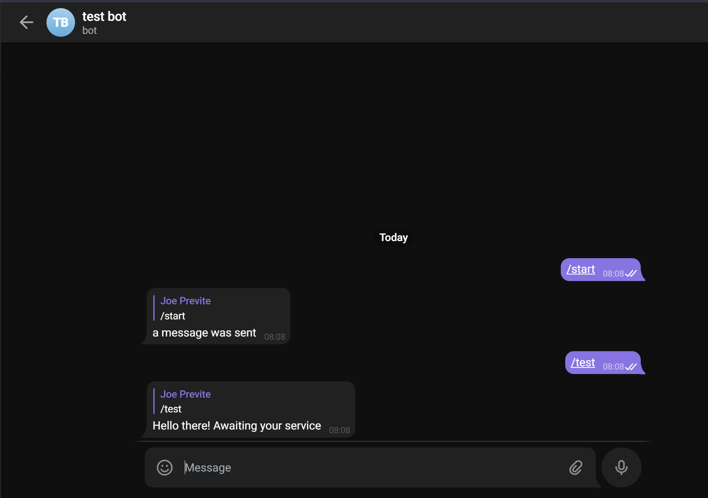

# telegram-bot-template
A Telegram bot template that uses telegraf.js + Next.js + Supabase

## Development 

1. Hit the "Use this Template" button
2. `git clone` the repo in your dev env
3. `yarn` to install dependencies
4. `ngrok http 3000` - expose port 3000 with ngrok
5. Create `.env` using `.env.example`
6. Add bot token to `.env`
7. `yarn start`
8. Go to `https://<ngrok-url>/api/telegram-hook?setWebhook=true` to set bot webhook url
9. Message bot /test and see it working

## Resources

If you get stuck or need to look at some other examples, check these: 
- https://www.marclittlemore.com/serverless-telegram-chatbot-vercel/
- https://telegraf.js.org/v3#/
- https://github.com/telegraf/telegraf/blob/develop/docs/examples/koa-webhook-bot.js
- https://github.com/telegraf/telegraf/issues/959